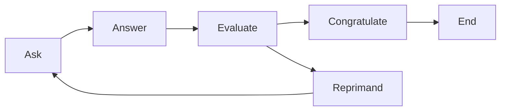

# Question Graph System

## Overview
This project implements a question-answer system using a Finite State Machine (FSM) pattern. It leverages Azure OpenAI for question generation and answer evaluation, with different modes of operation for various use cases.

## Architecture

### Core Components
- **FSM States**:
  - `Ask`: Generates questions using AI
  - `Answer`: Handles user input
  - `Evaluate`: Assesses answer correctness
  - `Congratulate`: Handles correct answers
  - `Reprimand`: Handles incorrect answers
  - `End`: Terminates the session



### File Structure
```
exam_pai_graph/
├── question_graph_base.py    # Core FSM implementation and shared components
├── question_graph_continuous.py  # Interactive continuous Q&A mode
├── question_graph_cli.py     # CLI mode with history support
├── question_graph_mermaid.py # Graph visualization generator
└── readme_pai_graph.md      # This documentation
```

## Component Details

### question_graph_base.py
- Core FSM implementation
- Defines state classes and transitions
- Manages Azure OpenAI integration
- Handles state data and context

Key classes:
```python
class QuestionState:
    question: str | None
    ask_agent_messages: list[ModelMessage]
    evaluate_agent_messages: list[ModelMessage]
```

### question_graph_continuous.py
- Interactive mode for continuous Q&A
- Real-time user input handling
- Graceful shutdown support
- Error handling and recovery

Usage:
```bash
python question_graph_continuous.py
```

### question_graph_cli.py
- Command-line interface with history support
- Session persistence via JSON
- Supports resuming previous sessions

Usage:
```bash
# Start new session
python question_graph_cli.py --new

# Continue with answer
python question_graph_cli.py "your answer"
```

### question_graph_mermaid.py
- Generates Mermaid diagram of the FSM
- Useful for documentation and visualization

Usage:
```bash
# Print to stdout
python question_graph_mermaid.py

# Save to file
python question_graph_mermaid.py output.md
```

## Dependencies
- `pydantic_graph`: FSM framework
- `pydantic_ai`: AI integration framework
- `logfire`: Logging and monitoring
- `devtools`: Development utilities
- Azure OpenAI API credentials (via environment variables)

## Environment Setup
Required environment variables:
```env
AZURE_OPENAI_ENDPOINT=<your-endpoint>
AZURE_OPENAI_BASE_URL=<your-base-url>
AZURE_OPENAI_API_KEY=<your-api-key>
AZURE_OPENAI_VERSION=<api-version>
```

## Error Handling
- Graceful shutdown support (Ctrl+C)
- Input validation
- State persistence
- Exception handling and logging

## Development Guidelines
1. **State Management**:
   - Keep states atomic and single-responsibility
   - Maintain clear transition rules
   - Document state changes

2. **Error Handling**:
   - Use appropriate error types
   - Implement graceful degradation
   - Log meaningful error messages

3. **Testing**:
   - Test state transitions
   - Validate error handling
   - Check persistence mechanisms

4. **Documentation**:
   - Update state diagrams when adding states
   - Document new environment requirements
   - Keep usage examples current

## Future Improvements
1. Add unit tests
2. Implement more sophisticated answer validation
3. Add support for different question types
4. Enhance session management
5. Add metrics and monitoring

## Troubleshooting
Common issues and solutions:
1. **API Connection**: Check environment variables
2. **History Loading**: Verify JSON format
3. **State Transitions**: Check FSM diagram
4. **Input Handling**: Validate input format 